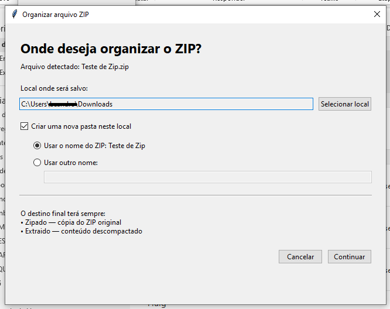
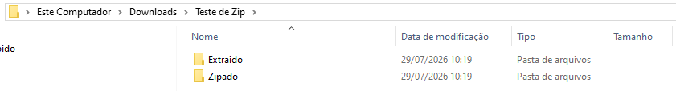
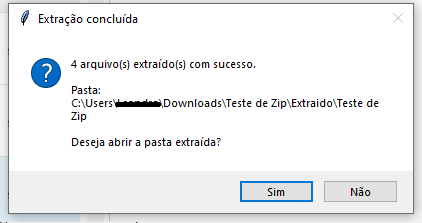

# Extrator Automático de ZIP

Aplicativo para Windows que monitora a pasta **Downloads** em segundo plano e
detecta automaticamente novos arquivos ZIP. Quando um download termina, o
programa pergunta onde o conteúdo deve ser organizado.

## Demonstração

### Organização do arquivo

Após detectar um novo ZIP, o aplicativo permite selecionar o local de destino,
criar uma pasta com o nome original do arquivo ou informar um nome
personalizado.



### Estrutura criada

O destino escolhido recebe pastas separadas para preservar o ZIP original e
armazenar o conteúdo extraído.



### Conclusão da extração

Ao finalizar, o aplicativo informa a quantidade de arquivos processados e
oferece a opção de abrir imediatamente a pasta extraída.



## Funcionalidades

- Inicialização automática com o Windows
- Monitoramento contínuo da pasta Downloads
- Detecção em aproximadamente 1 a 2 segundos
- Confirmação de que o ZIP terminou de baixar
- Escolha do local de destino
- Opção para criar uma nova pasta
- Nome da nova pasta baseado no ZIP ou personalizado
- Preservação do arquivo compactado original
- Extração segura contra travessia de diretórios e links simbólicos
- Proteção contra sobrescrita de arquivos e pastas existentes
- Pergunta para abrir a pasta extraída ao concluir
- Processamento manual de um ZIP pelo painel
- Instalação sem bibliotecas externas

## Estrutura criada

```text
Pasta escolhida ou criada/
├── Zipado/
│   └── arquivo.zip
└── Extraido/
    └── arquivo/
        └── conteúdo extraído
```

## Requisitos

- Windows 10 ou Windows 11
- Python 3.10 ou superior
- Testado com Python 3.12

O programa utiliza apenas módulos da biblioteca padrão do Python.

## Instalação

1. Baixe ou clone este repositório.
2. Mantenha `INSTALAR_E_INICIAR.bat` e `extrator_automatico.py` na mesma pasta.
3. Execute `INSTALAR_E_INICIAR.bat`.
4. Aguarde a confirmação da instalação.
5. Reinicie o Windows caso uma versão anterior já esteja em execução.

O instalador procura automaticamente o Python 3.12. Caso não encontre, abre uma
janela para selecionar manualmente o arquivo `python.exe`.

Um caminho comum é:

```text
C:\Users\SEU_USUARIO\AppData\Local\Programs\Python\Python312\python.exe
```

## Como usar

Após a instalação, baixe um novo arquivo `.zip`. Quando o download terminar, a
tela de organização será aberta automaticamente.

Nela, você poderá:

1. selecionar o local-base;
2. usar diretamente esse local ou criar uma nova pasta;
3. usar o nome original do ZIP ou informar outro nome;
4. confirmar a organização;
5. abrir a pasta extraída ao finalizar.

Arquivos ZIP que já estavam em Downloads antes da instalação são ignorados.

## Desinstalação

Execute `DESINSTALAR.bat` e reinicie ou encerre a sessão do Windows.

## Segurança

Antes da extração, o programa valida cada item do ZIP. Caminhos absolutos,
tentativas de sair da pasta de destino e links simbólicos são bloqueados.

O aplicativo não exclui o ZIP baixado e não substitui silenciosamente pastas
existentes.

## Autoria

Desenvolvido por [Letícia Vitória](https://github.com/leticiazooe).
